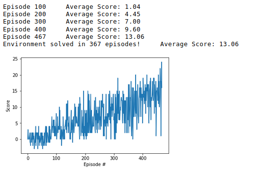

# Banana Collector using Deep Reinforcement Learning 

For this project, it's trained an agent to navigate (and collect bananas!) in a large, square world.

A reward of +1 is provided for collecting a yellow banana, and a reward of -1 is provided for collecting a blue banana. Thus, the goal of your agent is to collect as many yellow bananas as possible while avoiding blue bananas.

The state space has 37 dimensions and contains the agent's velocity, along with ray-based perception of objects around the agent's forward direction. Given this information, the agent has to learn how to best select actions. Four discrete actions are available, corresponding to:

    0 - move forward.
    1 - move backward.
    2 - turn left.
    3 - turn right.

The task is episodic, and in order to solve the environment, your agent must get an average score of +13 over 100 consecutive episodes.

### Vanilla Deep Q Learning

The main variation from the one in the paper is that is not used a convolutional neural network, instead that was changed for a feed forward neural network that provides the input vector of the state.

Trained with the following parameters:
* BUFFER_SIZE = int(1e5)  
* BATCH_SIZE = 64         
* GAMMA = 0.99            
* TAU = 1e-3              
* LR = 5e-4               
* UPDATE_EVERY = 4  

The model returned an average score of 11.49 after 100 episodes, a very successful model, however it has room for improvement modifying parameters and using a convnet to extract features, and changing the architechture of the DQN

    
    
### Instructions

Follow the instructions in navigation_drl.ipynb to get started with training the agent.
